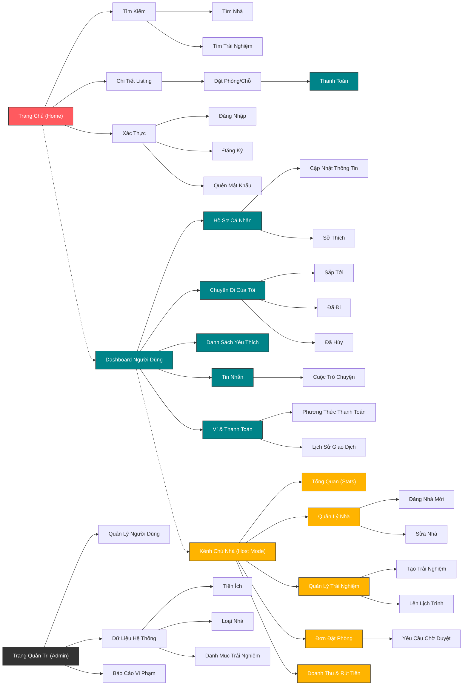

# Sitemap Hệ Thống Livana

Dưới đây là sơ đồ cấu trúc trang (Sitemap) của ứng dụng Livana được thể hiện bằng Mermaid.

```mermaid
graph LR
    %% Main Node
    Home["Trang Chủ (Home)"]

    %% Level 1: Public Areas
    Home --> Search["Tìm Kiếm"]
    Home --> ListingDetail["Chi Tiết Listing"]
    Home --> Auth["Xác Thực"]

    %% Level 2: Detail breakdown
    Search --> SearchHome["Tìm Nhà"]
    Search --> SearchExp["Tìm Trải Nghiệm"]
    ListingDetail --> Booking["Đặt Phòng/Chỗ"]
    Booking --> CheckOut["Thanh Toán"]

    Auth --> Login["Đăng Nhập"]
    Auth --> Register["Đăng Ký"]
    Auth --> ForgotPass["Quên Mật Khẩu"]

    %% Level 1: Logged In User
    Home -.-> UserDB["Dashboard Người Dùng"]
    
    UserDB --> Profile["Hồ Sơ Cá Nhân"]
    Profile --> EditProfile["Cập Nhật Thông Tin"]
    Profile --> UserInterests["Sở Thích"]
    
    UserDB --> Trips["Chuyến Đi Của Tôi"]
    Trips --> Upcoming["Sắp Tới"]
    Trips --> Past["Đã Đi"]
    Trips --> Cancelled["Đã Hủy"]

    UserDB --> Wishlist["Danh Sách Yêu Thích"]
    
    UserDB --> Inbox["Tin Nhắn"]
    Inbox --> Conversation["Cuộc Trò Chuyện"]
    
    UserDB --> Wallet["Ví & Thanh Toán"]
    Wallet --> PaymentMethods["Phương Thức Thanh Toán"]
    Wallet --> Transactions["Lịch Sử Giao Dịch"]

    %% Level 1: Host Mode
    UserDB -.-> HostMode["Kênh Chủ Nhà (Host Mode)"]
    
    HostMode --> HostDash["Tổng Quan (Stats)"]
    
    HostMode --> MyListings["Quản Lý Nhà"]
    MyListings --> CreateHome["Đăng Nhà Mới"]
    MyListings --> EditHome["Sửa Nhà"]
    
    HostMode --> MyExp["Quản Lý Trải Nghiệm"]
    MyExp --> CreateExp["Tạo Trải Nghiệm"]
    MyExp --> Schedule["Lên Lịch Trình"]
    
    HostMode --> HostReservations["Đơn Đặt Phòng"]
    HostReservations --> PendingReq["Yêu Cầu Chờ Duyệt"]
    
    HostMode --> HostWallet["Doanh Thu & Rút Tiền"]

    %% Level 1: Admin
    SubAdmin["Trang Quản Trị (Admin)"]
    
    SubAdmin --> UserMgmt["Quản Lý Người Dùng"]
    SubAdmin --> MasterData["Dữ Liệu Hệ Thống"]
    MasterData --> Amenities["Tiện Ích"]
    MasterData --> PropType["Loại Nhà"]
    MasterData --> Categories["Danh Mục Trải Nghiệm"]
    SubAdmin --> Reports["Báo Cáo Vi Phạm"]

    %% Styling
    classDef home fill:#ff5a5f,color:white,stroke:#333;
    classDef user fill:#008489,color:white,stroke:#333;
    classDef host fill:#FFB400,color:white,stroke:#333;
    classDef admin fill:#333,color:white,stroke:#333;

    class Home home;
    class UserDB,Profile,Trips,Wishlist,Inbox,Wallet,CheckOut user;
    class HostMode,HostDash,MyListings,MyExp,HostReservations,HostWallet host;
    class SubAdmin admin;
```
